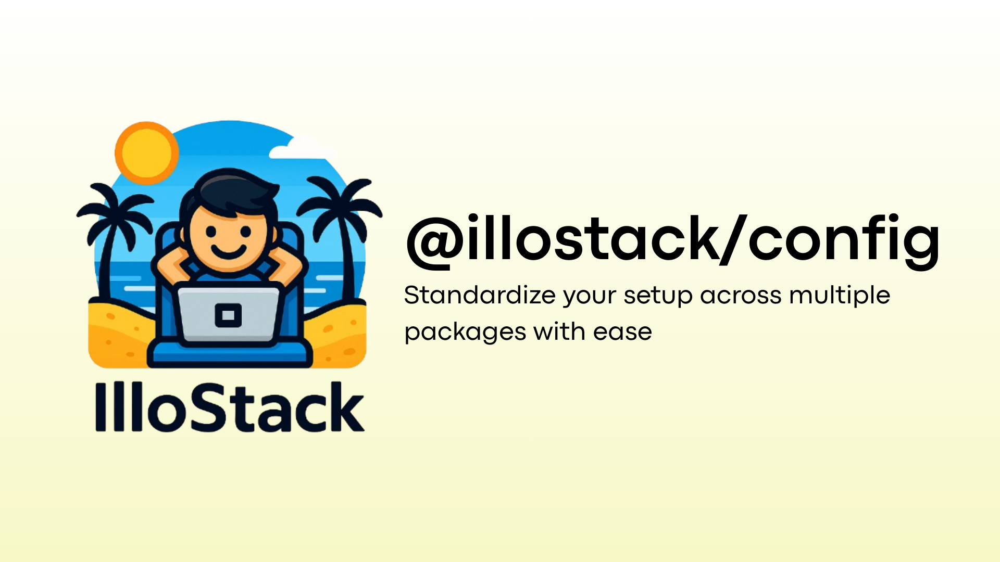

# IlloStack Config



Shared configuration files for IlloStack projects. Standardize your setup across multiple packages with ease.

## ✨ Features

- 📦 Shared configuration for:
  - TypeScript (`tsconfig`)
  - ESLint
- 🧠 Opinionated defaults for consistency across IlloStack packages
- 🔧 Easy to extend and override

## 📦 Installation

```bash
npm install --save-dev @illostack/eslint-config
npm install --save-dev @illostack/typescript-config
```

Or with `pnpm`:

```bash
pnpm add -D @illostack/eslint-config
pnpm add -D @illostack/typescript-config
```

## 🛠 Usage

### TypeScript

In your `tsconfig.json`:

```json
{
  "extends": "@illostack/typescript-config/base.json",
  "compilerOptions": {
    "outDir": "dist"
  }
}
```

### ESLint

In your `.eslintrc.mjs`:

```js
import { config } from "@illostack/eslint-config/base";

/** @type {import("eslint").Linter.Config} */
export default config;
```

## 🧱 Philosophy

This package aims to:

- Reduce boilerplate in each package
- Maintain consistency across all IlloStack projects
- Be easy to customize when needed

## 🧩 Extending Configurations

Each config is designed to be a base. You can override or merge your custom settings as needed.

For example, in TypeScript:

```json
{
  "extends": "@illostack/typescript-config/base.json",
  "compilerOptions": {
    "strict": false
  }
}
```

## 🧑‍💻 Contributing

If you want to add new configurations or propose changes, feel free to open a PR!

## 🐣 Part of the IlloStack ecosystem

This package is part of the [IlloStack](https://github.com/illostack) project, a collection of lightweight tools and libraries for modern web development.
